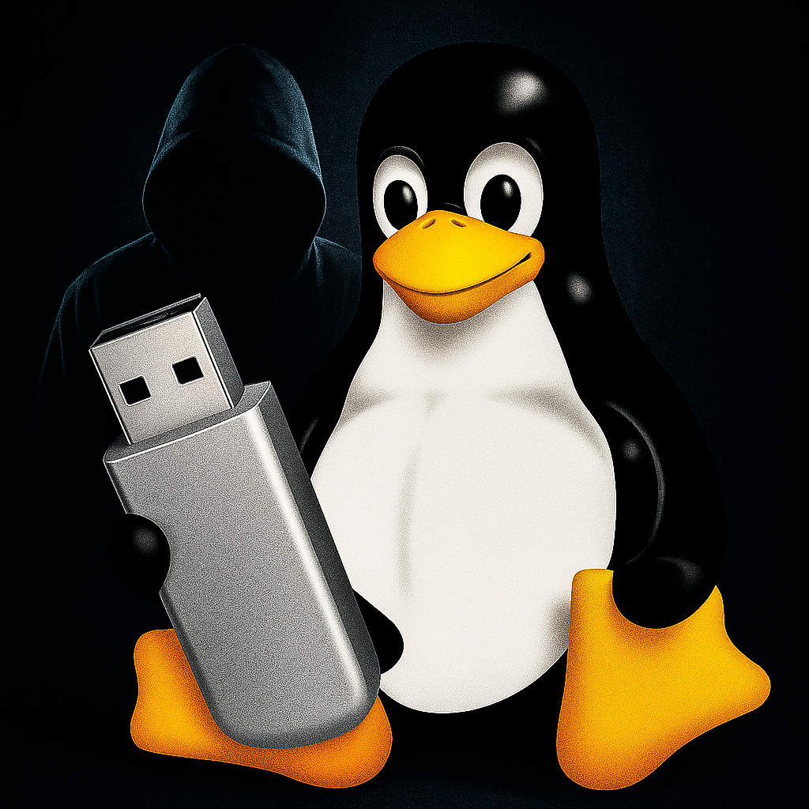
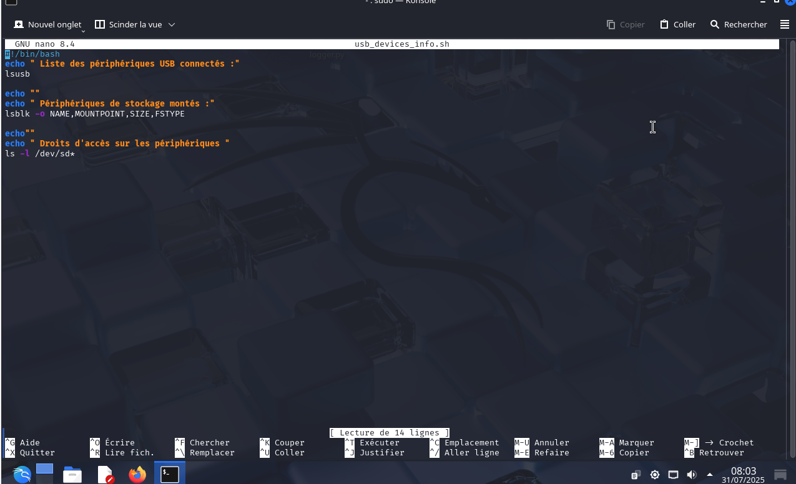
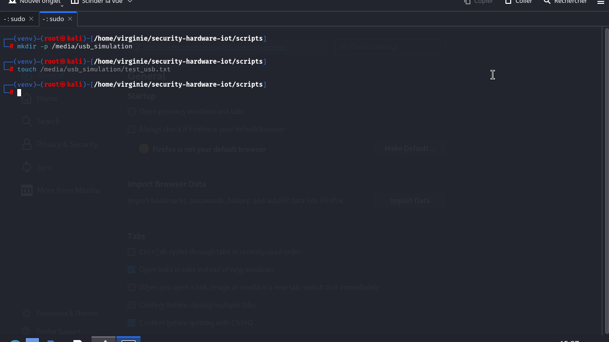
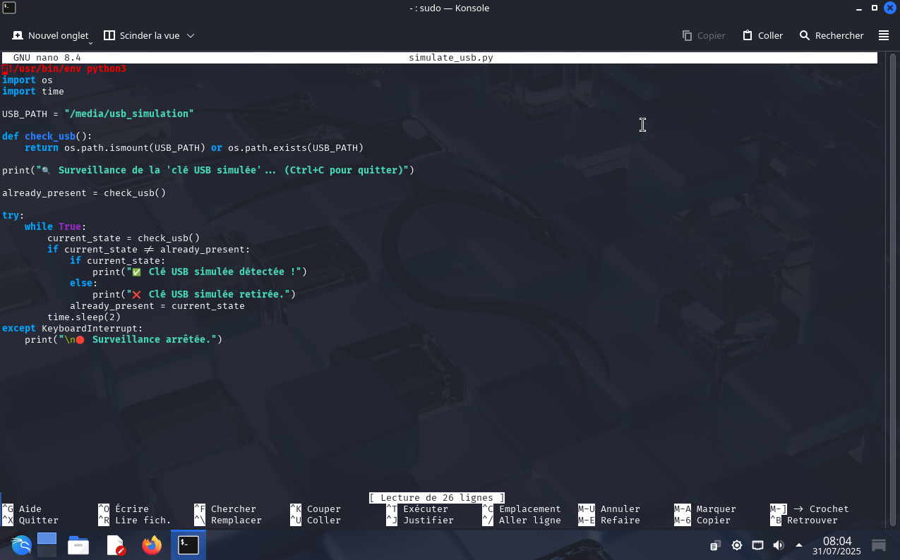
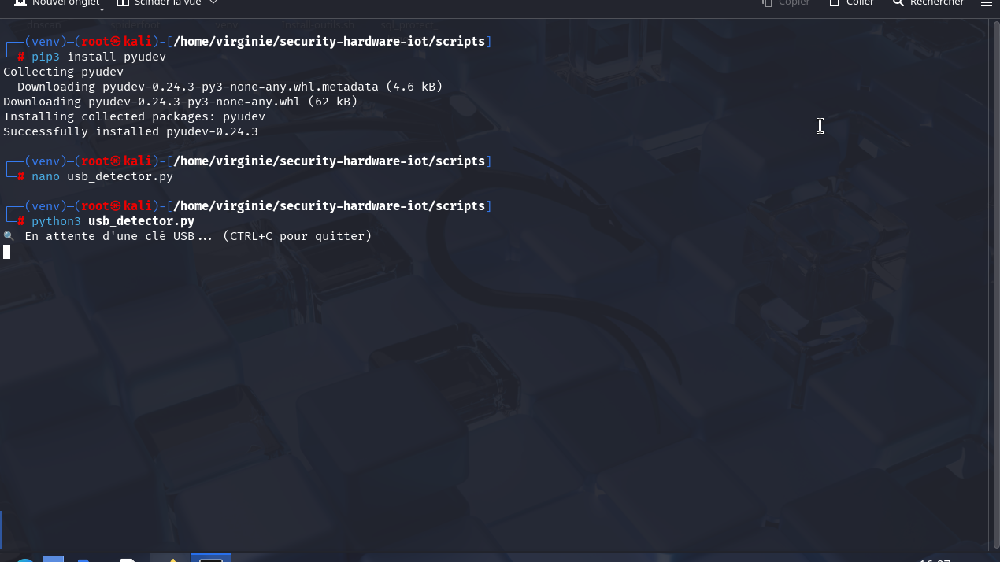
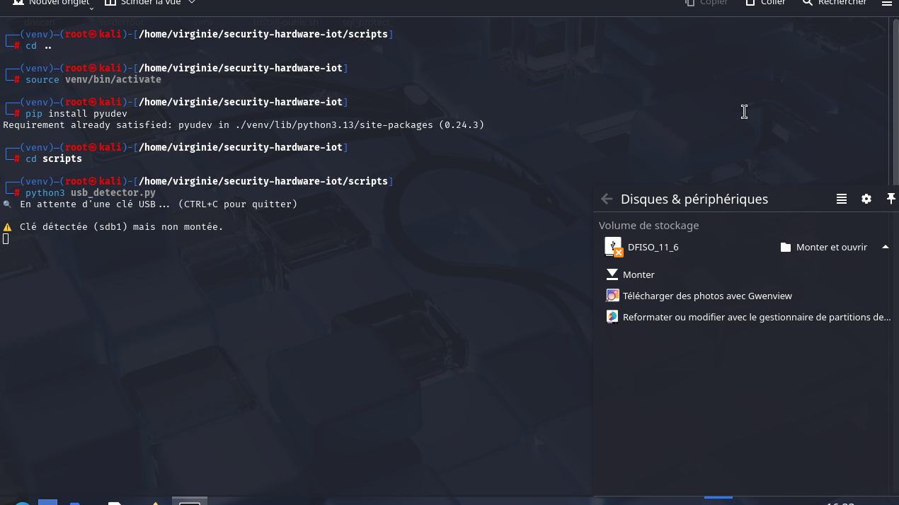
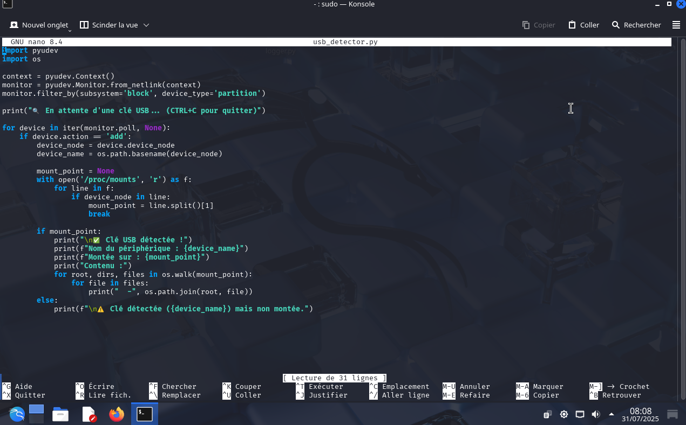

#  Détection et Surveillance des Clés USB sous Linux

<i>Illustration d’un script de détection USB sous Linux</i>

© 2025 <strong>Virginie Lechene</strong> — Tous droits réservés 
Reproduction interdite sans autorisation préalable. 
Usage pédagogique uniquement.

<strong>Image protégée – Propriété exclusive</strong>

## Sommaire

- [Objectif du projet](#objectif-du-projet)
- [Pourquoi la sécurité USB est essentielle](#pourquoi-la-sécurité-usb-est-essentielle)
- [À qui s’adresse ce projet](#à-qui-sadresse-ce-projet)
- [Niveaux du projet](#niveaux-du-projet)
- [Niveau débutant](#niveau-débutant)
- [Niveau intermédiaire](#niveau-intermédiaire)
- [Niveau avancé](#niveau-avancé)
- [Utilisation des scripts](#utilisation-des-scripts)
- [Licence](#licence)

---

## Objectif du projet

Ce projet a pour but de détecter et surveiller les périphériques USB sur un système Linux.
Il est structuré en trois niveaux de difficulté, permettant une montée progressive en compétences :

- Lister les périphériques USB connectés
- Simuler une clé USB pour tester la logique de détection
- Détecter automatiquement une clé USB réelle en temps réel

> Ce projet est conçu à des fins pédagogiques et a été testé dans un environnement **Kali Linux sous VirtualBox**.
 
💡 Idéal pour les débutants souhaitant comprendre comment Linux gère les périphériques USB au niveau système.

---

## Pourquoi la sécurité USB est essentielle

Les clés USB sont souvent utilisées comme vecteurs d’attaque :

- Introduction de malwares (clé infectée)
- Vol de données
- Attaques physiques via périphériques déguisés (BadUSB)
- Accès non autorisée dans des environnements sensibles

Il est donc **essentiel de surveiller et détecter** tout périphérique USB connecté à une machine, en particulier sur les postes critiques.

---

ℹ️ À propos de l’exécution des scripts
usb_devices_info.sh fonctionne sur toute machine Linux pour lister les périphériques USB connectés.

simulate_usb.py permet de tester la logique de détection sans clé USB physique, en simulant une insertion via un dossier local.

usb_detector.py nécessite un système Linux avec un port USB physique. Il ne peut pas être exécuté dans GitHub Actions (cloud), uniquement sur une machine locale.

 Ce projet est conçu à des fins pédagogiques, pour comprendre les mécanismes de surveillance des périphériques USB sous Linux.

---

❓ Pourquoi ne pas simplement utiliser 
lsusb
 ?
Ce projet ne se limite pas à un simple alias de commande comme lsusb.

La commande lsusb affiche uniquement la liste des périphériques connectés à un instant T.

Elle ne permet pas de :

détecter en temps réel l’insertion ou le retrait d’un périphérique,

savoir où le périphérique est monté dans le système,

accéder automatiquement à son contenu,

ou déclencher une surveillance automatisée.

---

## À qui s’adresse ce projet

### Public visé & Objectifs pédagogiques

| Public | Objectifs |
|---------------------------|-----------|
| **Étudiants en cybersécurité** | Comprendre les risques USB et créer ses premiers scripts |
| **Formateurs / enseignants** | Appui pour travaux pratiques encadrés (TP) |
| **Administrateurs système** | Surveiller les postes sensibles pour des connexions USB |
| **Pentesters / pros sécurité** | Démontrer les vecteurs d’intrusion physiques |

---

## Niveaux du projet

### Niveau débutant

**Objectif** : Identifier les périphériques USB connectés via des commandes de base.

**Script :** `usb_devices_info.sh`

bash
#!/bin/bash

echo "Liste des périphériques USB connectés :"
lsusb

echo -e "\nPériphériques montés :"
lsblk

📸 Captures d’écran :

*Affichage du script dans Nano*

*Exécution dans le terminal sous Kali Linux*

📄 Contenu du script `usb_devices_info.sh`

---

### Niveau intermédiaire

**Objectif** : Simuler l’insertion d’une clé USB en utilisant un dossier comme point de montage.

Ce niveau permet de tester la logique de détection **sans clé USB physique**, à l'aide d'une **clé USB virtuelle** (un simple dossier).

---

###  Étapes réalisées

1. Création d’un dossier simulant une clé USB :
bash
mkdir -p /media/usb_simulation
touch /media/usb_simulation/test_usb.txt

Création du script simulate_usb.py :

import os
import time

usb_path = "/media/usb_simulation"

print("Surveillance de la clé USB simulée... (Ctrl+C pour quitter)")
while True:
if os.path.exists(usb_path):
print("Clé USB simulée détectée !")
break
time.sleep(1)

chmod +x simulate_usb.py
./simulate_usb.py

---

**"J'ai créé une clé USB virtuelle, un script de détection, et je l'ai testé dans le terminal."**

### 📸 Captures d’écran

 
*Dossier `/media/usb_simulation` et fichier `test_usb.txt` utilisés pour simuler une clé USB*

 
*Script Python chargé de détécter la présence de la "clé USB simulée"*

 
*La clé USB simulée est détectée avec succès par le script*

📄 Contenu du script `simulate_usb.py`

*Script Python chargé de détecter la présence d’une "clé USB simulée"*

---

### Niveau avancé

**Objectif** : Détecter en **temps réel l’insertion d’une vraie clé USB** grâce à la bibliothèque `pyudev`.

Contrairement au niveau intermédiaire (clé simulée via dossier), ici le test est réalisé **avec une véritable clé USB physique**, branchée sur la machine.

Le script Python s’appuie sur le système d’événements `udev` de Linux pour intercepter automatiquement toute connexion d’un périphérique USB de stockage.

---

### 📸 Captures d’écran

*Installation de `pyudev` et lancement du script en attente d’une clé USB*

*Détection effective d’une vraie clé USB physique (ex. : /dev/sdb1)*

📄 Contenu du script `usb_detector.py`

*Script Python chargé de détecter une vraie clé USB physique via `pyudev`*
Ce projet contient un script Python permettant de détecter l'insertion d'une clé USB en temps réel sous Linux.
⚠️ Ce script nécessite un environnement avec un port USB réel (pas exécutable dans GitHub Actions).

---

## Utilisation des scripts

L’usage des clés USB peut représenter un risque majeur pour la sécurité d’un système, surtout dans des environnements sensibles (entreprises, laboratoires, établissements scolaires, etc.). Voici pourquoi ce projet est important :

⚠️ Risques potentiels liés aux clés USB :
Propagation de malwares (virus, ransomware, chevaux de Troie)

Vol de données sensibles (exfiltration par simple copier-coller)

Injection de commandes malveillantes (ex : BadUSB)

Accès non autorisé à des systèmes protégés

Sabotage et altération de fichiers critiques

Objectif du projet :
Sensibiliser à ces risques

Apprendre à détecter automatiquement et en temps réel l’insertion d’un périphérique USB

Créer une base pédagogique pour aller plus loin (alertes, blocage, journalisation…)

Ce projet montre que, même avec un niveau débutant ou intermédiaire, il est possible de mettre en place une surveillance simple mais efficace.

---

## Licence

Le script est publié sous la licence MIT.
🔒 Avertissement sur les modifications

Ce script est fourni à des fins pédagogiques en l’état.

L’autrice décline toute responsabilité en cas de modification, dérivation ou adaptation du code source.

Toute altération, réutilisation ou redistribution du script se fait sous l’entière responsabilité de l’utilisateur

---

ℹ️ **À propos de l’usage**
Ce projet est destiné exclusivement à des fins pédagogiques :
- Formations en cybersécurité
- Tests d’intrusion légaux (pentests)
- Analyse ou audit en environnement contrôlé

L’autrice ne cautionne ni n’autorise l’usage, en dehors d’un cadre légal strictement défini.
Toute utilisation non conforme est interdite et relève de la responsabilité exclusive de l’utilisateur.

---

 **Droits sur les visuels**
Les visuels, illustrations ou captures présents dans ce dépôt sont la propriété exclusive de l’autrice.
Toute reproduction ou réutilisation sans autorisation préalable est interdite.

© 2025 Virginie Lechene – Tous droits réservés.

