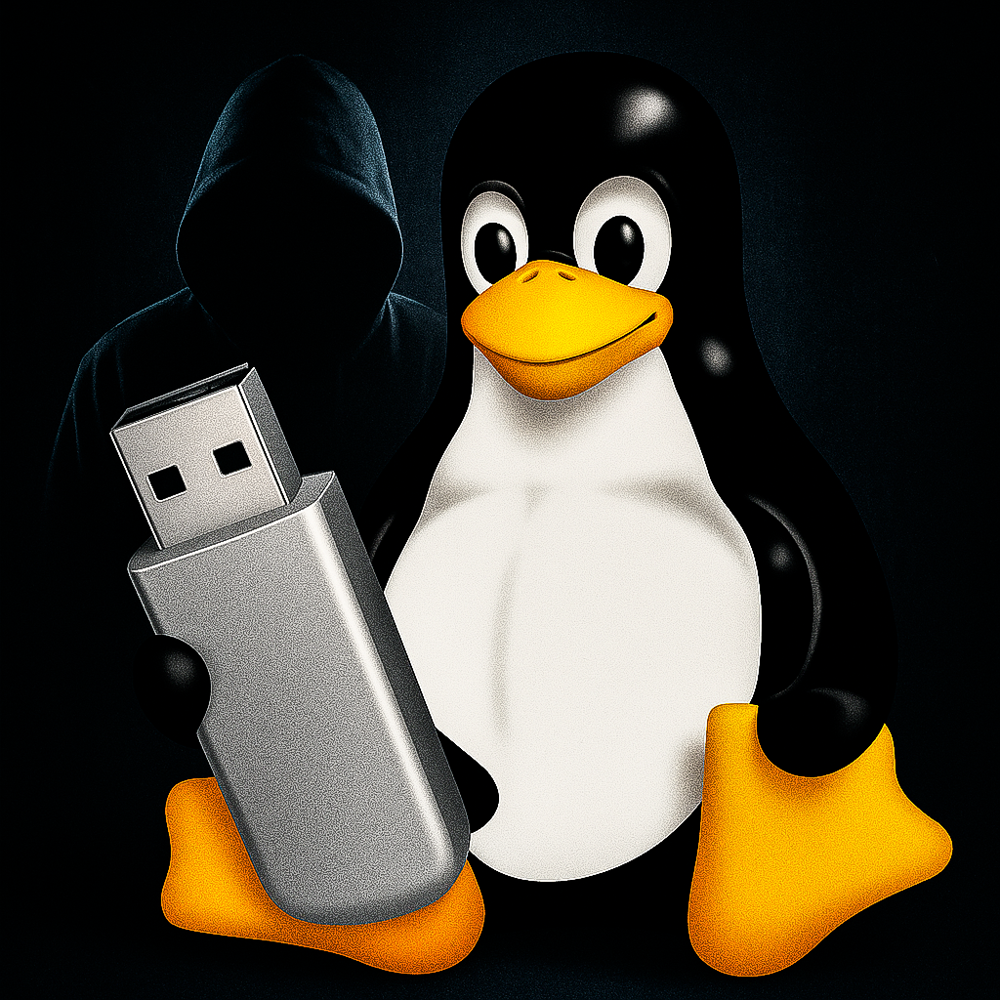
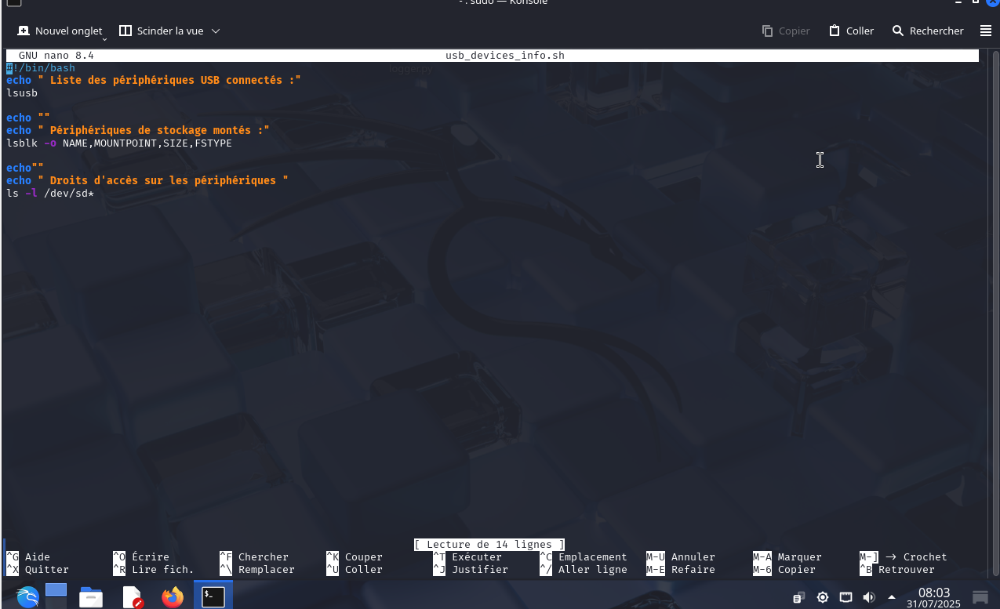
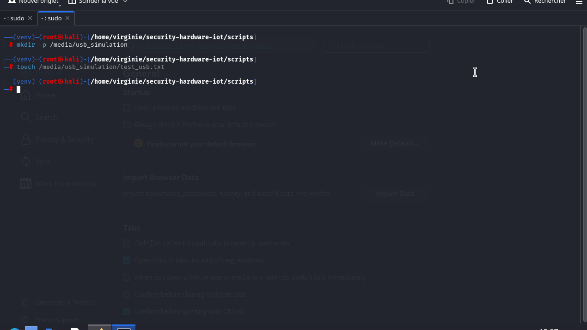
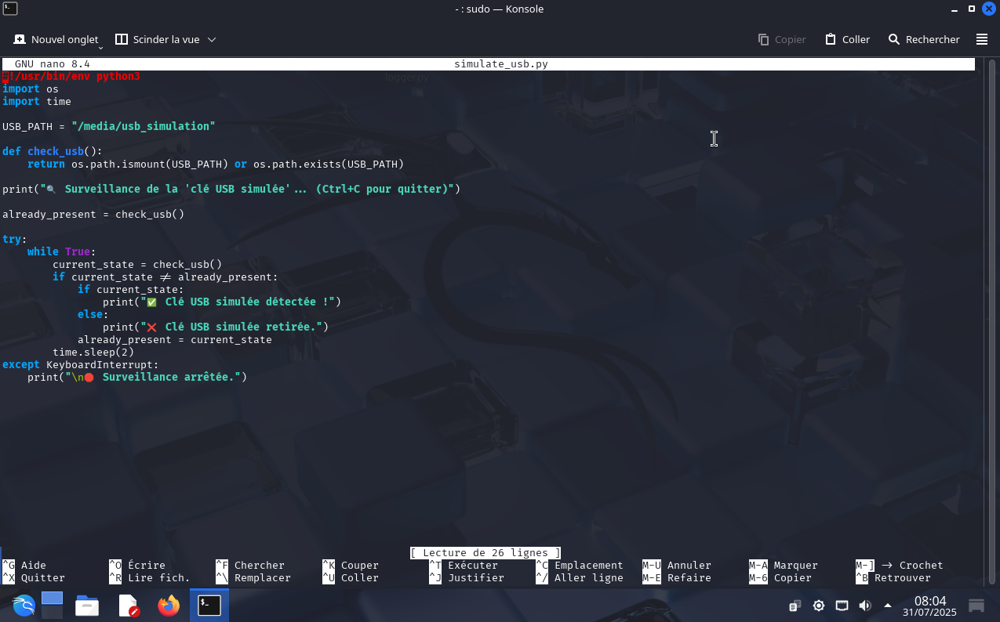
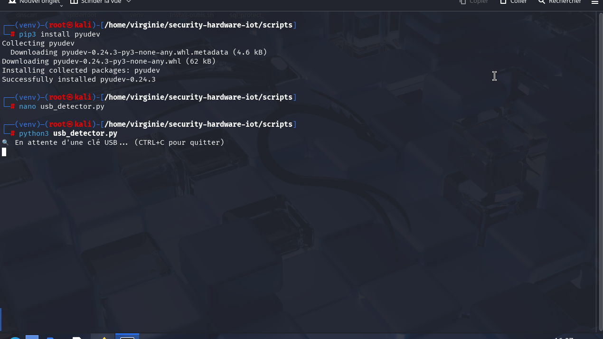
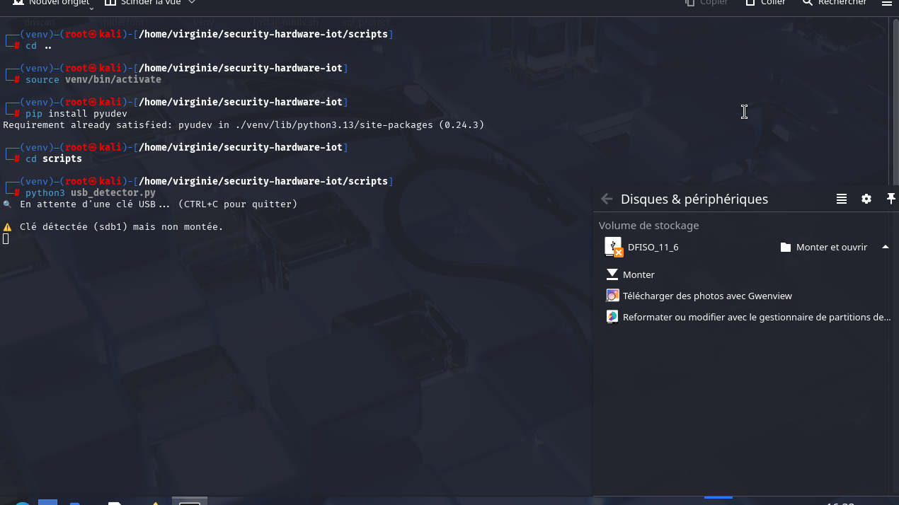
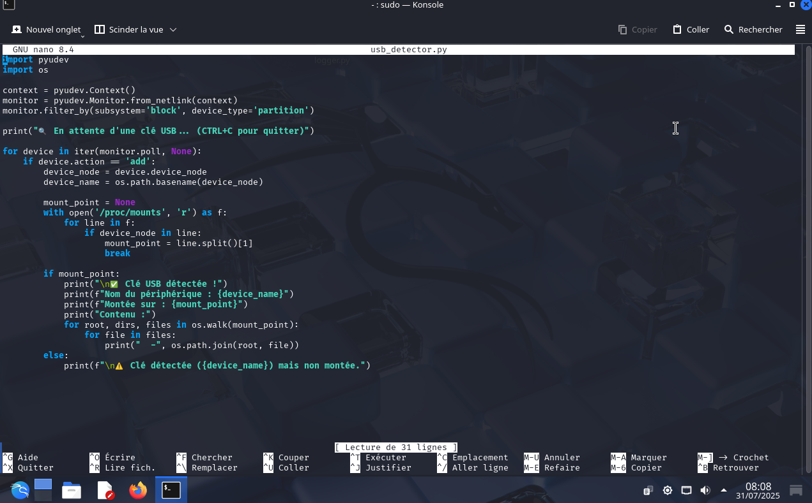

# 🐧 Détection et Surveillance des Clés USB sous Linux

<i>Illustration d’un script de détection USB sous Linux</i>

© 2025 <strong>Virginie Lechene</strong> 

<strong>Image protégée - Propriété exclusive</strong>

----

Sommaire 

- [Objectif du projet](#objectif-du-projet)
- [Pourquoi la sécurité USB est essentielle](#pourquoi-la-sécurité-usb-est-essentielle)
- [À qui s’adresse ce projet](#à-qui-sadresse-ce-projet)
- [Niveaux du projet](#niveaux-du-projet)
- [Niveau débutant](#niveau-débutant)
- [Niveau intermédiaire](#niveau-intermédiaire)
- [Niveau avancé](#niveau-avancé)
- [Utilisation des scripts](#utilisation-des-scripts)
- [Licence](#licence)
- [FAQ](#faq)

---

## Objectif du projet

Ce projet a pour but de détecter et surveiller les périphériques USB sur un système Linux.
Il est structuré en trois niveaux de difficulté, permettant une montée progressive en compétences :

- Lister les périphériques USB connectés
- Simuler une clé USB pour tester la logique de détection
- Détecter automatiquement une clé USB réelle en temps réel

> Ce projet est conçu à des fins pédagogiques et a été testé dans un environnement **Kali Linux sous VirtualBox**.
 
💡 Idéal pour les débutants souhaitant comprendre comment Linux gère les périphériques USB au niveau système.

---

💡 Pourquoi la sécurité USB est essentielle

Les clés USB sont souvent utilisées comme vecteurs d’attaque :

- Introduction de malwares (clé infectée)
- Vol de données
- Attaques physiques via périphériques déguisés (BadUSB)
- Accès non autorisé dans des environnements sensibles

Il est donc **essentiel de surveiller** tout périphérique USB connecté à une machine, notamment sur les postes critiques, afin de prévenir tous comportements non autorisés.

---

ℹ️ À propos de l’exécution des scripts

usb_devices_info.sh fonctionne sur toute machine Linux pour lister les périphériques USB connectés.

simulate_usb.py permet de tester la logique de détection sans clé USB physique, en simulant une insertion via un dossier local.

usb_detector.py nécessite un système Linux avec un port USB physique. Il ne peut pas être exécuté dans GitHub Actions (cloud), uniquement sur une machine locale.

 Ce projet est conçu à des fins pédagogiques, pour comprendre les mécanismes de surveillance des périphériques USB sous Linux.

---

❓ Pourquoi ne pas simplement utiliser lsusb ?
 
Ce projet ne se limite pas à un simple alias de commande comme lsusb.

La commande lsusb affiche uniquement la liste des périphériques connectés à un instant T.

Elle ne permet pas de :

détecter en temps réel l’insertion ou le retrait d’un périphérique,

savoir où le périphérique est monté dans le système,

accéder automatiquement à son contenu,

ou déclencher une surveillance automatisée.

---

## À qui s’adresse ce projet

### Public visé & Objectifs pédagogiques
Ce projet pédagogique s'adresse à différents profils, chacun pouvant y trouver un objectif spécifique :

| Public | Objectifs |
|---------------------------|-----------|
| **Étudiants en cybersécurité** | Comprendre les risques USB et créer ses premiers scripts |
| **Formateurs / enseignants** | Appui pour travaux pratiques encadrés (TP) |
| **Administrateurs système** | Surveiller les postes sensibles pour des connexions USB |
| **Pentesters / pros sécurité** | Démontrer les vecteurs d’intrusion physiques |

---

## Niveaux du projet

### Niveau débutant

**Objectif** : Identifier les périphériques USB connectés via des commandes de base.

**Script :** `usb_devices_info.sh`

bash
#!/bin/bash

echo "Liste des périphériques USB connectés :"
lsusb

echo -e "\nPériphériques montés :"
lsblk

📸 Captures d’écran :

*Affichage du script dans Nano*

*Exécution dans le terminal sous Kali Linux*

📄 Contenu du script `usb_devices_info.sh`

---

### Niveau intermédiaire

**Objectif** : Simuler l’insertion d’une clé USB en utilisant un dossier comme point de montage.

Ce niveau permet de tester la logique de détection **sans clé USB physique**, à l'aide d'une **clé USB virtuelle** (un simple dossier).

---

###  Étapes réalisées

1. Création d’un dossier simulant une clé USB :
bash
mkdir -p /media/usb_simulation
touch /media/usb_simulation/test_usb.txt

Création du script simulate_usb.py :

import os
import time

usb_path = "/media/usb_simulation"

print("Surveillance de la clé USB simulée... (Ctrl+C pour quitter)")
while True:
if os.path.exists(usb_path):
print("Clé USB simulée détectée !")
break
time.sleep(1)

chmod +x simulate_usb.py
./simulate_usb.py

---

**"J'ai créé une clé USB virtuelle, un script de détection, et je l'ai testé dans le terminal."**

### 📸 Captures d’écran

 
*Dossier `/media/usb_simulation` et fichier `test_usb.txt` utilisés pour simuler une clé USB*

 
*Script Python chargé de détécter la présence de la "clé USB simulée"*

 
*La clé USB simulée est détectée avec succès par le script*

📄 Contenu du script `simulate_usb.py`

*Script Python chargé de détecter la présence d’une "clé USB simulée"*

---

### Niveau avancé

**Objectif** : Détecter en **temps réel l’insertion d’une vraie clé USB** grâce à la bibliothèque `pyudev`.

Contrairement au niveau intermédiaire (clé simulée via dossier), ici le test est réalisé **avec une véritable clé USB physique**, branchée sur la machine.

Le script Python s’appuie sur le système d’événements `udev` de Linux pour intercepter automatiquement toute connexion d’un périphérique USB de stockage.

---

### 📸 Captures d’écran

*Installation de `pyudev` et lancement du script en attente d’une clé USB*

*Détection effective d’une vraie clé USB physique (ex. : /dev/sdb1)*

📄 Contenu du script `usb_detector.py`

*Script Python chargé de détecter une vraie clé USB physique via `pyudev`*
Ce projet contient un script Python permettant de détecter l'insertion d'une clé USB en temps réel sous Linux.
⚠️ Ce script nécessite un environnement avec un port USB réel (pas exécutable dans GitHub Actions).

---

## Utilisation des scripts

L’usage des clés USB peut représenter un risque majeur pour la sécurité d’un système, en particulier dans des environnements sensibles (entreprises, laboratoires, établissements scolaires, etc.).

Ce projet prend tout son sens dans ce contexte, car il permet :

🔥 D’identifier les risques liés aux clés USB : propagation de malwares (virus, chevaux de Troie, ransomwares…)

🕵️‍♂️ De détecter les tentatives de vol de données (copier-coller sauvage, extraction manuelle…)

🧨 De simuler ou repérer des attaques physiques (ex : BadUSB)

🚫 De bloquer l’accès non autorisé à un système via des périphériques inconnus

🖥️ De protéger les postes critiques, notamment dans les environnements industriels ou éducatifs

🎓 D’offrir un support pédagogique concret pour :

Apprendre à détecter automatiquement l’insertion ou le retrait d’une clé USB

Créer des bases de détection automatisée (alertes, journalisation, blocage, etc.)

⚠️ Le script avancé nécessite un environnement avec un port USB réel. Il n’est pas exécutable dans GitHub Actions (cloud).

---

## Licence

Le script est publié sous la licence MIT.
🔒 Avertissement sur les modifications

Ce script est fourni à des fins pédagogiques en l’état.

L’autrice décline toute responsabilité en cas de modification, dérivation ou adaptation du code source.

Toute altération, réutilisation ou redistribution du script se fait sous l’entière responsabilité de l’utilisateur

---

ℹ️ **À propos de l’usage**
Ce projet est destiné exclusivement à des fins pédagogiques :
- Formations en cybersécurité
- Tests d’intrusion légaux (pentests)
- Analyse ou audit en environnement contrôlé

L’autrice ne cautionne ni n’autorise l’usage, en dehors d’un cadre légal strictement défini.
Toute utilisation non conforme est interdite et relève de la responsabilité exclusive de l’utilisateur.

---

## 📷 Droits sur les visuels

Les visuels de ce dépôt sont protégés par la licence CC BY-ND 4.0.
Attribution obligatoire – Modification interdite.

© 2026 Virginie Lechene

---

##  FAQ 

### 💡 Est-ce que ces scripts fonctionnent sous Windows ou macOS ?
Non. Le projet est conçu pour fonctionner exclusivement sous Linux (testé avec Kali Linux).  
Les commandes utilisées (comme `lsusb`, `udev`, `mount`, etc.) sont spécifiques à Linux.

---

###  Pourquoi les scripts ne sont pas exécutables dans GitHub Actions ?
GitHub Actions n’offre pas d’accès physique aux ports USB.  
Les scripts doivent être testés sur une machine locale avec du matériel USB réel pour fonctionner correctement.

---

###  À quoi sert la simulation de clé USB avec un dossier ?
C’est un moyen simple et pédagogique de tester une détection d’insertion sans matériel.  
Cela permet aux débutants de comprendre la logique d’un script de surveillance avant de brancher une vraie clé USB.

---

### 🔐 Est-ce que ce projet remplace un antivirus ou un outil de sécurité professionnel ?
Non. Ce projet a une visée pédagogique. Il ne remplace pas une solution de sécurité.  
Il est cependant utile pour comprendre les risques liés aux périphériques USB et apprendre à s’en protéger.

---

###  Puis-je utiliser ce projet pour surveiller les USB dans une entreprise ?
Ce n’est pas recommandé tel quel. Il faudrait renforcer les scripts (logs, alertes, blocages…) pour un usage professionnel.  
Mais c’est une bonne base de réflexion pour bâtir une solution plus complète.

---

